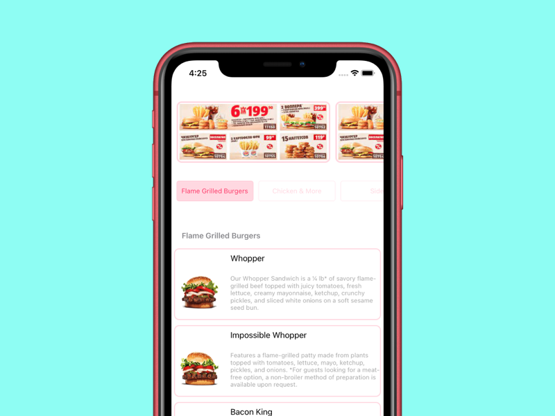

# testTaskMenu

Test project, tha main task is to show restaurant menu with category filters, auto scroll to category.

## Stack
* UIKit
* Kingfisher
* SwiftLint
* SnapKit

## Screenshots
### Main screen

### Scroll to other category
")
